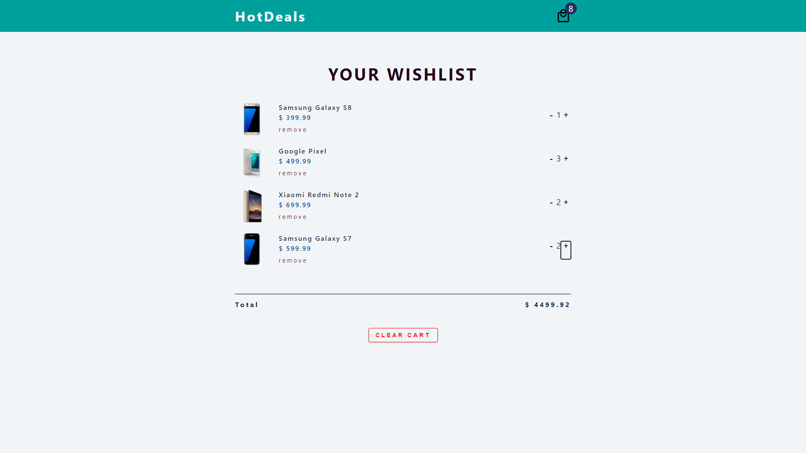

# React App
## ```My Cart Web Application - React.js, React-Hooks, External API CSS```

># [Deploy Project](https://modest-joliot-bdea03.netlify.app) 
>Main Page


>### This app is a wishlist.

>###### Used context, also created a global context. Made a fetch request from External API. I separated the components and filled them with functionality.

>###### On the main page you will see your wishlist, just add or remove those items that you dreamed of so much on the "+" and "-" buttons, respectively.

## All dreams come true!